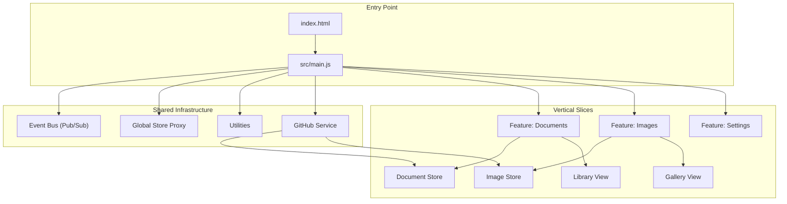
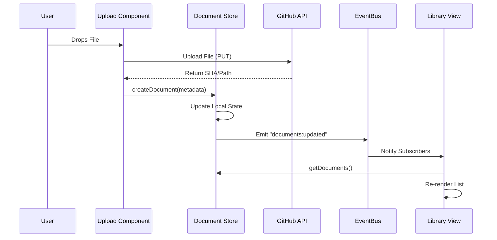

# Invisible Support Portal

A robust, agent-optimized, and modular support portal designed for long-term maintainability. This project demonstrates a **Vertical Slice Architecture (VSA)** implemented with **vanilla ES Modules**, ensuring zero build steps, zero dependency hell, and maximum compatibility with AI coding assistants.

---

## 🏗️ Architecture & Philosophy

### Vertical Slice Architecture (VSA)
Instead of organizing code by technical layers (e.g., Controllers, Views), we organize by **Features**. Each feature (e.g., `Documents`, `Images`) is a self-contained slice containing its own UI, Logic, and State.

### The "Zero-Build" Mandate
- **No Webpack/Vite/Rollup**: The code you write is the code the browser runs.
- **Native ES Modules**: Uses `<script type="module">` for dependency management.
- **Agent-Friendly**: The file structure is explicitly designed to minimize context token usage for AI agents (Claude, Gemini, Copilot), allowing them to reason about single features without loading the entire codebase.

---

## 🧩 System Breakdown

### 1. Core Bootstrapper (`src/main.js`)
The single entry point for the application.
- **Responsibilities**:
    - Imports all feature modules.
    - Initializes the `Localization` system.
    - Exposes necessary modules to the global `window` scope (only for legacy compatibility during migration).
    - Waits for `DOMContentLoaded` to kick off the app.

### 2. Shared Infrastructure (`src/shared/`)
Reusable "plumbing" used by all features.
- **`infrastructure/event-bus.js`**: A lightweight Pub/Sub system for decoupling features. Features emit events (`document:created`) rather than calling each other directly.
- **`services/github.js`**: Deep integration with the GitHub API for persistence. Handles file uploads, content retrieval, and config validation.
- **`services/storage-manager.js`**: Manages local storage quotas and persistence strategies.
- **`localization/index.js`**: A zero-dependency i18n engine.

### 3. Feature Slices (`src/features/`)
#### 📄 Documents Slice
Handles the uploading, listing, and visual management of PDF/DOCX files.
- **`store.js`**: Manages the list of documents and syncs with `storage/documents.json` in the repo.
- **`upload.js`**: Controls the drag-and-drop zone and upload queue.
- **`library-view.js`**: Renders the document grid list.

#### 🖼️ Images Slice
Handles image assets with visual previews.
- **`store.js`**: Manages image records and metadata (dimensions, types).
- **`gallery.js`**: Renders the visual gallery grid.
- **`viewer.js`**: Provides the full-screen image preview modal.

---

## 🔄 Data Interactivity

The application uses an **Event-Driven State** model. Stores update their state and emit notifications, while UI components subscribe to these updates.

---

## 🚀 Usage & Workflows

### 🔧 Configuration (First Run)
Because this is a serverless application, it needs a backend to store files. We use **Your GitHub Repository** as the database.
1. Open the **Repository storage** panel.
2. Enter your **Repository Owner** (username) and **Repository Name**.
3. Generate a **Personal Access Token** (Classic) with `repo` scope and paste it.
4. Click **Save** and **Test Connection**.

### 📤 Uploading Assets
1. Drag & Drop files into the "Upload workflow" area.
2. Watch the progress bar (files are being committed to `uploads/` folder in your repo).
3. Once finished, assets appear instantly in the **Asset Library**.

### 📦 Deployment
This project is designed for **GitHub Pages**.
1. Push the code to a `main` branch.
2. Enable GitHub Pages in Repository Settings (Source: `Deploy from branch`, `/root`).
3. The site is live! No build commands (`npm run build`) are ever needed.

---

## 🛠️ Developer Notes

- **Adding a new feature**: Create a new folder in `src/features/`. Create a `store.js` for data and `index.js` for UI. Import it in `src/main.js`.
- **Debugging**: Use `ReferenceError`? Check `src/main.js` to see if your module is imported.
- **Testing**: Run `npm run serve` to test locally.

---
*Generated by Antigravity Agent · 2026*
