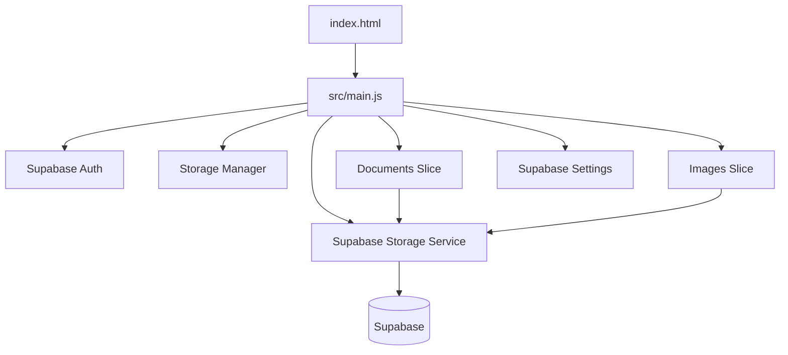

# Invisible Support Portal

A static support upload portal built with vanilla ES modules and a vertical-slice structure. It runs directly from GitHub Pages with no build step, while durable private storage is provided by Supabase Auth, Supabase Storage, and a small metadata table.

For a complete engineering, maintenance, and troubleshooting reference, see the [Code Manual](docs/CodeMan.md).

---

## Architecture

The app is organized by feature rather than by technical layer. Documents, images, settings, storage UI, and shared services each live in their own modules under `src/`.



### Shared Services

- `src/shared/services/auth-client.js` manages Supabase email magic-link sign-in and session state.
- `src/shared/services/supabase-storage.js` uploads, downloads, lists, and deletes private assets through Supabase.
- `src/shared/services/storage-manager.js` tracks storage usage and applies the configured budget.
- `src/shared/config/supabase.js` contains the checked-in Supabase URL, publishable key, bucket name, table name, and default storage limit.

### Feature Slices

- Documents: upload queue, metadata store, library table, and document previewer.
- Images: image validation, upload flow, gallery, zoomable viewer, and metadata display.
- Settings: Supabase email sign-in, sign-out, storage limit, and connection test.

---

## Supabase Backend

The portal uses:

- Supabase email magic-link authentication.
- One private Storage bucket: `invisible-support-assets`.
- One RLS-protected metadata table: `public.assets`.
- Storage object paths shaped as `{user_id}/{documents|images}/{asset_id}/{filename}`.

Run `supabase/schema.sql` in the Supabase SQL editor to create the bucket, table, indexes, and RLS policies.

Only the Supabase publishable key belongs in browser code. Never commit a service role key.

---

## First Run

1. Create or open your Supabase project.
2. Run `supabase/schema.sql`.
3. In Supabase Auth settings, set the site URL to:
   `https://invisibleacropolis-ops.github.io/InvisibleSupport/`
4. Add redirect URLs for:
   `https://invisibleacropolis-ops.github.io/InvisibleSupport/`
   and `http://localhost:8080/**`.
5. Edit `src/shared/config/supabase.js` with your project URL and publishable key.
6. Open the portal, enter your email in **Supabase storage**, and click **Send magic link**.
7. After signing in, click **Test connection** and upload a file.

---

## Migration

Existing repo-backed assets can be migrated into Supabase with:

```powershell
$env:SUPABASE_URL = "https://<project-ref>.supabase.co"
$env:SUPABASE_SERVICE_ROLE_KEY = "<service-role-key>"
$env:SUPABASE_MIGRATION_USER_ID = "<auth-user-uuid>"

npm run supabase:migrate -- -DryRun
npm run supabase:migrate
```

The migration script reads `storage/documents.json`, `storage/images.json`, and the matching files under `uploads/`, then uploads them into the private Supabase bucket and inserts metadata rows.

---

## Development

Serve locally with:

```powershell
npm run serve
```

Open `http://localhost:8080/`.

Run browser tests with:

```powershell
npm test
```

Run the real Supabase smoke test with a signed-in user access token:

```powershell
$env:SUPABASE_URL = "https://<project-ref>.supabase.co"
$env:SUPABASE_ANON_KEY = "<publishable-key>"
$env:SUPABASE_ACCESS_TOKEN = "<signed-in-user-access-token>"
$env:SUPABASE_TEST_USER_ID = "<auth-user-uuid>"

npm run supabase:smoke
```

The smoke script uploads a real temporary file, inserts metadata, reads it back, downloads the object, and deletes both row and object.
