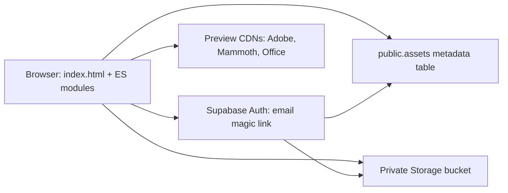
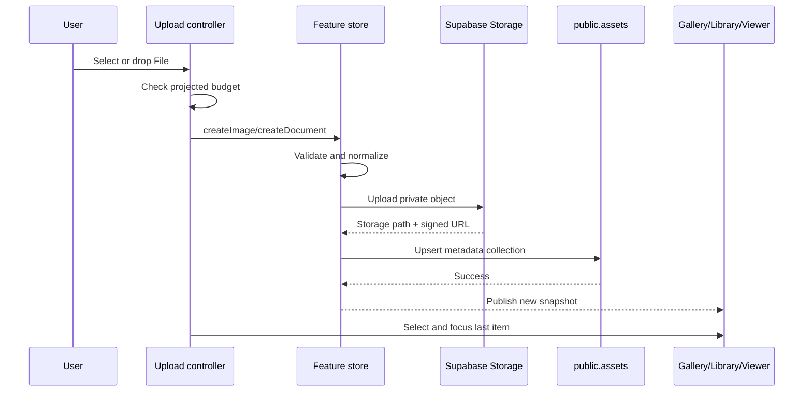

# Invisible Support Code Manual

Engineering, maintenance, and troubleshooting guide

Last reviewed: 2026-08-04

## 1. Purpose and audience

This manual explains the current implementation of Invisible Support Portal for engineers, troubleshooters, and programmers who are new to the repository. After reading it, a contributor should be able to:

- run the portal locally;
- identify which module owns a visible behavior;
- trace an image, document, audio track, or video from selection through Supabase and back to its viewer;
- change a data field, viewer, upload rule, or panel without breaking adjacent features;
- diagnose authentication, Row Level Security, Storage, quota, preview, and layout failures;
- run the appropriate browser or real-backend checks before shipping a change.

This is a description of the code as it exists now. Where the repository contains compatibility code, partially wired UI, or an operational caveat, the manual calls it out explicitly.

## 2. System at a glance

Invisible Support is a static, framework-free web application. There is no compilation or application server. The browser loads `index.html`, then loads native JavaScript ES modules. Supabase supplies authentication, private object storage, and asset metadata.



Key characteristics:

- The frontend is deployable directly to GitHub Pages or any static host.
- JavaScript modules are organized into feature slices for images, documents, audio/video playback and upload, settings, and storage UI.
- The Supabase publishable key is shipped to the browser. Security comes from authenticated sessions and RLS policies, not from hiding that key.
- Uploaded files are private. The UI receives time-limited signed URLs for display and sharing.
- The UI stores only small preferences in `localStorage`; durable asset records and file bytes live in Supabase.
- The checked-in `storage/*.json` files are migration inputs from the earlier repository-backed design. The running application does not use them as its live database.

## 3. Quick start for developers

### Prerequisites

- Windows with PowerShell
- A current Node.js and npm installation
- Chromium installed by Playwright, if browser tests will be run
- A Supabase project, if real authentication or storage operations will be tested

Install the locked dependencies:

```powershell
npm ci
```

Start the static development server:

```powershell
npm run serve
```

Open `http://localhost:8080/`. Do not open `index.html` through a `file://` URL. Native module loading, CDN imports, authentication redirects, and fetches require an HTTP origin.

Run the non-destructive end-to-end browser checks:

```powershell
npm run test:e2e
```

Run all Playwright tests, including screenshot comparisons:

```powershell
npm test
```

Screenshot baselines are intentionally strict. Update them only after visually reviewing an intentional design change:

```powershell
npm run test:update
```

## 4. Repository map

| Area | Responsibility |
| --- | --- |
| `index.html` | Complete page markup, design tokens, component CSS, accessibility attributes, CDN script tags, and the ES-module entry point |
| `src/main.js` | Imports modules, exposes compatibility globals, starts authentication, and initializes every feature |
| `src/features/images/` | Image model, upload controller, searchable gallery, and zoomable viewer |
| `src/features/documents/` | Document model, upload queue, searchable library, and multi-format viewer |
| `src/features/audio/` | Audio-file detection, searchable library, native player, loop modes, and optional playlist queue |
| `src/features/video/` | Video-file detection, searchable library, responsive native player, loop modes, and optional playlist queue |
| `src/features/media/` | Shared audio/video player, library, and queued-upload controller factories |
| `src/features/settings/` | Supabase session and storage-budget form |
| `src/features/storage/` | Usage meter and clear-all modal |
| `src/shared/config/` | Checked-in Supabase project configuration |
| `src/shared/services/` | Supabase client, auth, object/metadata adapter, usage manager, and base resource store |
| `src/shared/ui/` | Toasts, inline feedback, and resizable split panes |
| `src/shared/infrastructure/` | General event bus and reactive proxy store |
| `src/shared/localization/` | English strings and translation helpers |
| `supabase/schema.sql` | Bucket, metadata table, indexes, and RLS policies |
| `scripts/` | Real Supabase migration and smoke-test scripts |
| `storage/` | Legacy JSON manifests consumed by the migration script |
| `tests/e2e/` | Functional browser checks |
| `tests/visual/` | Screenshot regression suite |
| `Setup.md` | Short Supabase provisioning checklist |

`deploy_refactor.py` is a historical one-off script that removed a fixed line range from an older monolithic Index file. Its line assumptions no longer describe the current page. Do not run it as a deployment step.

The `three` package is currently listed as an application dependency but is not imported by the active portal code.

## 5. Runtime architecture and startup

### 5.1 Browser entry point

The page loads the Adobe Document Cloud View SDK with a deferred script and loads `src/main.js` as a module at the end of the body. Native modules are therefore the dependency system; there is no bundler.

Some imports contain query-string versions such as `?v=20260706-2`. These are cache-busting suffixes for static hosting. The browser still resolves them to the same source files.

The Supabase JavaScript client is not installed from `package.json`. It is dynamically imported at runtime from `https://esm.sh/@supabase/supabase-js@2`. Large-video uploads dynamically import the pinned `tus-js-client@4.3.1` browser ESM entry from the same CDN; do not replace it with the package's generic ESM entry because that entry defaults to the Node adapter. DOCX rendering dynamically loads Mammoth from jsDelivr. Office previews use Microsoft Office Online. A browser or Content Security Policy that blocks those origins will lose the corresponding functionality.

### 5.2 Initialization order

`main.js` performs this sequence:

1. Imports shared infrastructure, Supabase services, feature stores, views, and UI components.
2. Exposes selected module namespaces on `window` for compatibility and browser-console diagnostics.
3. Applies localized strings to elements with `data-i18n-key`.
4. Starts Supabase authentication initialization and a session probe asynchronously.
5. Initializes Supabase settings and the storage meter/modal.
6. Initializes the document viewer, library, and upload controller.
7. Initializes the image viewer, gallery, and upload controller.
8. Initializes the audio and video players and libraries over the document-store snapshot.
9. Initializes the dedicated audio and video upload controllers.
10. Initializes resizable split panes.
11. Attaches generic collapse/expand behavior to remaining `data-panel-toggle` buttons.

The resource-store singletons are constructed when their modules are imported. Each store immediately starts a Supabase read. UI subscriptions receive an immediate snapshot, so the page can first render empty and then rerender when the asynchronous read finishes.

Initialization functions use an `initialized` flag. Calling an `init()` function twice is intended to be harmless.

### 5.3 Compatibility globals

The following namespaces are exposed on `window`:

- `Utils`
- `Localization`
- `Notifications`
- `EventBus`
- `Store`
- `SupabaseStorage`
- `AuthClient`
- `StorageManager`
- `DocumentStore`
- `ImageStore`
- `DocumentViewer`
- `ImageViewer`
- `ImageGallery`
- `LibraryView`
- `AudioPlayer`
- `AudioLibrary`
- `VideoPlayer`
- `VideoLibrary`

`openStorageModal` and `closeStorageModal` are also exposed. New code should normally use ES imports. The globals are useful for interactive diagnostics and older integration points.

## 6. Index page and UI contracts

### 6.1 What Index owns

`index.html` is intentionally substantial. It owns:

- font declarations and all CSS;
- dark-theme design tokens;
- the semantic page skeleton;
- all form controls and empty states;
- `data-*` hooks used by JavaScript modules;
- ARIA labels, live regions, dialogs, and split-pane separators;
- the Adobe SDK and main-module script tags.

There are no templates or components compiled at build time. Feature modules locate the existing DOM and populate it or attach listeners.

### 6.2 Selector convention

Treat selector types differently:

- CSS classes are primarily presentation contracts.
- `data-*` attributes are JavaScript behavior contracts.
- IDs connect labels, headings, dialogs, and accessibility relationships.

When renaming or moving a `data-*` attribute, search the entire source tree first. A missing selector usually causes a module to return early or silently skip an element rather than throw an obvious error.

### 6.3 Design system

The page defines CSS custom properties for colors, typography, spacing, radii, shadows, and transition speed. The current visual language is a near-black terminal surface with cyan accents and self-hosted Silkscreen fonts. Radii and shadows are deliberately set to zero.

Reusable primitives include:

- `.u-card` for panels;
- `.u-btn` variants for controls;
- `.u-input` for inputs and selects;
- `.stack` for vertical layout;
- `.u-modal` for overlays;
- toast and inline-feedback classes;
- upload, gallery, library, viewer, settings, and storage-specific classes.

The self-hosted fonts and license live under `assets/fonts/`. Keep the license file if the font assets are redistributed.

### 6.4 Page sections

The main grid contains:

1. Image Gallery and Image Viewer
2. Document Library and Document Viewer
3. Audio Library and Audio Player
4. Video Library and Video Player
5. Image Upload and Document Upload
6. Audio Upload and Video Upload
7. Supabase Storage settings and usage meter
8. Toast live region
9. Clipboard confirmation markup
10. Storage-management modal

The Image Viewer, Document Viewer, Audio Player, and Video Player are permanently expanded and do not contain collapse buttons. Gallery, library, upload, and settings cards still use the generic collapse controller.

### 6.5 Resizable split panes

The split-pane module treats each `.split-pane` as first panel, separator, and last panel. It controls the first panel width with `--split-left`.

Behavior:

- Mouse drag and touch drag resize from 15% through 85%.
- Arrow Left and Arrow Right change the split by 1 percentage point.
- Holding Shift changes the keyboard step to 5 points.
- Home moves to 15%; End moves to 85%.
- The chosen percentage is stored in `localStorage` as `splitPane:<data-split-id>`.
- Below 960 pixels, panels stack vertically and the separator is hidden.

The image and document collection pairs opt into viewer-height matching. A `ResizeObserver` watches the viewer on the right and writes its live height to `--matched-viewer-height`. The gallery or library on the left uses that value as its vertical cap. Changes in preview content or horizontal width therefore update the paired height automatically.

Within the capped left cards, the search controls stay fixed while the image list or document table uses internal `overflow: auto`. The document table header is sticky. A scrollbar is visible only when content actually exceeds the available height.

To reset a bad saved divider position from the browser console:

```js
localStorage.removeItem('splitPane:img-split');
localStorage.removeItem('splitPane:doc-split');
location.reload();
```

## 7. State and event model

The active feature slices use small module-local variables and explicit subscriptions rather than one global application store.

### Resource store subscriptions

`ImageStore.subscribe()` and `DocumentStore.subscribe()` immediately call the listener with a defensive copy of the current items. They call listeners again after loading, adding, removing, or clearing records.

### Viewer selection events

The viewers emit DOM custom events:

- `imageviewerchange` with `{ id }`
- `documentviewerchange` with `{ id }`

The gallery and library listen for these events to synchronize selected styling and ARIA state.

### Shared EventBus and Store

The general `EventBus` provides `subscribe`, `emit`, `once`, `clear`, and `clearAll`. The general reactive `Store` wraps an object with a `Proxy` and emits namespaced property and change events. Both are imported and exposed globally, but the current image and document slices do not depend on them. They are available extension points, not the primary state mechanism.

## 8. Supabase integration

### 8.1 Checked-in browser configuration

`SUPABASE_CONFIG` contains:

| Setting | Current meaning |
| --- | --- |
| `projectUrl` | Supabase project REST/Auth/Storage origin |
| `publishableKey` | Browser-safe publishable key |
| `bucket` | Private bucket name, currently `invisible-support-assets` |
| `assetsTable` | Metadata table name, currently `assets` |
| `signedUrlExpiresInSeconds` | Signed-link lifetime, currently 3600 seconds |

Never place a service-role key in browser code, HTML, committed configuration, screenshots, or test fixtures. The publishable key is safe to expose only because the database and bucket are protected by RLS.

The settings form exposes the checked-in project and bucket and manages authentication. It cannot change the project URL, publishable key, bucket, table, or a storage budget at runtime. The former `invisibleSupport.supabaseConfig` budget preference is removed on startup and is not used for upload decisions.

### 8.2 Supabase client

The client is created lazily and cached. Auth options are:

- persistent sessions;
- automatic token refresh;
- session detection in the redirect URL;
- PKCE flow.

`getRedirectUrl()` returns the current page URL with its hash removed. Supabase must allow that origin and path in Authentication URL Configuration.

### 8.3 Authentication

Authentication uses email OTP/magic links:

1. The user enters an email in Supabase Storage settings.
2. `sendMagicLink()` normalizes it to lowercase and calls `signInWithOtp`.
3. Supabase emails a link whose redirect target is the current page.
4. On return, the Supabase client detects the session in the URL and persists it.
5. Auth subscribers update the settings form and enable connection testing.

The last requested email is stored as `invisibleSupport.supabaseEmail`. It is a convenience value, not an authentication credential.

Auth state exposes `configured`, `user`, `email`, and `lastEmail`. `isConnected()` checks for a user ID. Every storage operation independently calls `client.auth.getUser()` before accessing data, so a stale UI label does not bypass authorization.

After completing a magic-link flow, reload the portal if the gallery or library remains empty. Store loading occurs during module startup and configuration notifications; the stores do not directly subscribe to `AuthClient` state changes.

### 8.4 Database schema

The backend uses `public.assets`:

| Column | Type | Purpose |
| --- | --- | --- |
| `id` | text primary key | Browser-generated asset ID |
| `owner_id` | uuid | References `auth.users`; cascade deletes metadata |
| `kind` | text | `document` or `image` |
| `name` | text | Stored filename |
| `title` | text | Display title |
| `description` | text | Document description |
| `alt` | text | Image alternative text |
| `mime_type` | text | MIME type used by viewers |
| `size_bytes` | bigint | Client-reported file size |
| `storage_path` | text | Object path in the private bucket |
| `width`, `height` | integer | Image dimensions when known |
| `captured_at` | timestamptz | Image capture time when known |
| `exif` | jsonb | Image metadata; defaults to an empty object |
| `created_at` | timestamptz | Row creation timestamp |
| `updated_at` | timestamptz | Last application update timestamp |

The owner/kind/update index supports the common per-user list ordered by newest update.

The schema constrains `kind` to `document` or `image`. Adding a third asset kind requires a schema change before the browser can write rows.

### 8.5 Row Level Security

The metadata table enables RLS and grants authenticated users select, insert, update, and delete only when `owner_id = auth.uid()`.

The private bucket policies grant authenticated users access only when:

- the bucket is `invisible-support-assets`; and
- the first folder of the object name equals their authenticated user ID.

The browser constructs paths in this form:

```text
<user-id>/images/<asset-id>/<encoded-filename>
<user-id>/documents/<asset-id>/<encoded-filename>
```

The migration and smoke-test user ID must match the identity represented by the token or the RLS policies will reject access.

### 8.6 Supabase storage adapter

`SupabaseStorage` is the translation boundary between browser models and Supabase rows/objects.

Reading a collection:

1. Require an authenticated user.
2. Select rows matching `kind`.
3. Order by `updated_at` descending.
4. Create a signed URL for every row.
5. Map snake_case database fields to the browser item shape.

This creates one signed-URL request per returned item. Large libraries may therefore become request-heavy even though the row query is a single request.

Writing a collection upserts all supplied rows by `id`. An empty array is a no-op in `writeItems`; explicit delete and clear paths perform removal.

Uploading an image, document, or audio file through the compatibility path:

1. The feature store reads the browser `File` into a data URL.
2. The base64 payload is passed to `uploadFile()` with a legacy-style path.
3. The adapter parses the kind, ID, and filename from that path.
4. It builds the user-owned Supabase path.
5. It decodes base64 into a Blob and uploads with `upsert: false`.
6. It returns the object path and a signed URL.
7. The feature store then persists the metadata collection.

Uploading a video uses `uploadFileObject()` instead. The original browser `File` is sent without data-URL/base64 expansion. Files at or below 6 MiB use the standard Supabase Storage upload API; larger files use the Supabase resumable-upload endpoint through `tus-js-client`, with 6 MiB chunks and bounded automatic retries. Both routes retain `upsert: false`, use the same authenticated owner path and metadata persistence, and report transfer progress to the shared media-upload controller.

The MIME type used during object upload is inferred from the filename in the storage adapter. The feature record retains the browser MIME type or its feature-specific fallback.

Deleting a file removes the object and then deletes the metadata row whose ID is parsed from the third path segment. Resource-store removal subsequently persists the reduced in-memory collection.

Downloading requires authentication and uses the Storage download API. Viewers use this as a fallback when a signed URL fetch fails and when opening a protected image in a new tab.

Compatibility methods named `readManifest`, `writeManifest`, and `deleteManifest` map legacy names containing `image` to the image kind and everything else to documents. `buildRawUrl()` and `looksLikePat()` are legacy stubs and currently return an empty string and `false`.

### 8.7 Signed URLs

Signed URLs expire after one hour under the current configuration. A record can remain valid while a copied link has expired. Reloading data generates new links. Do not treat `downloadUrl` or `blobUrl` as permanent public URLs.

In the current Supabase model, `repoPath` means the private Supabase object path, not a Git repository path. `sha` is retained for compatibility but is normally empty. `blobUrl` generally mirrors the signed `downloadUrl` until a viewer creates a temporary local object URL.

### 8.8 Storage usage accounting

`StorageManager` tracks the sum of item `size` values for documents and images so the portal can display how much user content is represented by loaded metadata. It publishes:

- `used`
- `limit: null`
- `ratio: 0`
- `isWarning: false`
- `isExceeded: false`

The portal deliberately imposes no per-file or aggregate byte limit. `canStore()` always returns true and `getRemainingCapacity()` returns positive infinity for compatibility with older callers. Image, document, audio, and video controllers do not perform a client-side capacity rejection.

Supabase plan, bucket, network, and browser constraints remain authoritative. The usage total depends on metadata loaded into the browser and can differ from physical bucket usage if rows and objects are out of sync.

## 9. Shared service and UI modules

### 9.1 BaseResourceStore

`BaseResourceStore` implements the common collection lifecycle:

- subscribe and immediately publish a snapshot;
- load metadata through `StorageManager`;
- sort newest updates first;
- strip transient `blobUrl` values before persistence;
- restore `blobUrl` from signed `downloadUrl` values after reads;
- generate UUIDs with a timestamp/random fallback;
- rename duplicate filenames with ` (2)`, ` (3)`, and so on;
- add, remove, clear, get one, and get all;
- upload a base64 payload through `SupabaseStorage`.

The `reconcile()` method is intentionally a no-op. The current adapter treats object and row operations as one storage domain rather than comparing a repository manifest.

An upload object is created before the metadata upsert. If the object upload succeeds and metadata persistence fails, the browser can leave an orphaned object. Troubleshoot this by comparing Storage objects with `public.assets` rows for the same asset ID.

Removal catches and logs object-deletion failures, then continues to update the in-memory collection. This keeps the UI responsive but can also leave an orphaned object when Storage deletion fails.

### 9.2 Utilities

The utility module provides:

- byte, relative-time, and date-time formatting;
- Blob object-URL creation and cleanup;
- data URL to Blob/base64 conversion;
- `FileReader` progress reporting;
- clipboard copying with `navigator.clipboard` and a legacy textarea fallback.

Object URLs created through the registry should be revoked. Some viewers create and revoke their own temporary URLs directly.

### 9.3 Localization

The localization module currently contains English only. `t()` resolves dot-separated keys and replaces `{placeholder}` tokens. `apply()` fills elements carrying `data-i18n-key`; for inputs and textareas it assigns `placeholder`, otherwise `textContent`.

Missing keys are returned literally. If the UI displays a string such as `upload.complete`, the code requested a key that is absent from the dictionary.

### 9.4 Notifications

`toast()` creates dismissible success, error, or info notifications in the toast live region. Default lifetime is five seconds. Error toasts use assertive live announcements; other tones are polite.

`inline()` writes a feedback message into a provided element, applies error/success classes, and toggles visibility and alert semantics.

### 9.5 Storage UI

The storage UI subscribes to usage, document, and image snapshots. It renders total represented bytes, an explicit `No portal limit` status, per-kind totals, and the clear-all modal. It does not render a capacity progress bar or warning state.

Clear All calls both feature stores concurrently. Each store attempts to remove its objects and then clears its metadata kind. This is a destructive operation with no undo.

## 10. Image feature slice

### 10.1 Browser item model

```js
{
  id,
  name,
  title,
  alt,
  type,
  size,
  width,
  height,
  updatedAt,
  capturedAt,
  exif,
  repoPath,
  sha,
  downloadUrl,
  blobUrl
}
```

### 10.2 Image store

The image store extends `BaseResourceStore` with:

- supported image MIME checking;
- browser image decoding to discover dimensions;
- an 8192-pixel maximum on either dimension;
- filename-based MIME fallback;
- EXIF date normalization;
- image record creation.

The supported set includes JPEG, PNG, WebP, AVIF, GIF, HEIC/HEIF, SVG, and TIFF. The implementation also accepts other MIME types beginning with `image/`. Browser decoding support still determines whether dimensions can be read.

EXIF parsing is currently disabled during upload, so new images receive an empty EXIF object. The viewer and search code are ready to display/search selected EXIF fields if a future parser populates them.

### 10.3 Image upload

The image controller supports file selection and drag/drop. Files are processed sequentially.

For each file it:

1. checks the projected application budget;
2. validates type and browser-decodable dimensions;
3. reads the file as base64 while reporting progress;
4. uploads the object;
5. persists metadata;
6. publishes the updated collection.

For a multi-image upload, a supplied title and alt text receive numeric suffixes. On success the last uploaded image is selected and focused in the gallery.

### 10.4 Gallery

The gallery subscribes to the image store and supports:

- grid and list modes;
- case-insensitive search over title, filename, MIME type, alt text, camera, model, and lens;
- lazy thumbnail loading with `IntersectionObserver`;
- selected-state synchronization with the viewer;
- mouse selection and keyboard Enter/Space selection;
- Delete-key and button removal;
- focus recovery after deletion.

The list scrolls internally inside the viewer-matched gallery card.

### 10.5 Image viewer

The image viewer supports:

- Fit (`contain`), Fill (`cover`), and Actual modes;
- zoom from 25% to 200%;
- EXIF orientation transforms;
- title, filename, dimensions, size, type, alt text, capture date, and selected EXIF display;
- direct-link display;
- protected download and open-in-new-tab behavior.

When opening a Supabase-backed image, the viewer downloads the private object, creates a temporary Blob URL, opens it, and schedules revocation after one minute.

## 11. Document feature slice

### 11.1 Browser item model

```js
{
  id,
  name,
  title,
  description,
  type,
  size,
  updatedAt,
  repoPath,
  sha,
  downloadUrl,
  blobUrl
}
```

### 11.2 Document store

The document store accepts any browser `File`. It infers common office, text, PDF, CSV, RTF, and JSON MIME types when the browser does not supply one. It reads the complete file into memory as a data URL, uploads it, and then persists the record.

There is no document-size limit beyond the configured application budget, browser memory, network limits, and Supabase limits.

### 11.3 Upload queue

The document upload controller deduplicates queued files by filename, size, and last-modified timestamp. Users can add files, remove individual entries, or clear the queue. A normal form submission processes the queued files sequentially.

Dropping files on the document dropzone both adds them and immediately begins processing the current queue. The queue is locked while uploading. After success, the last document is selected and focused in the library.

### 11.4 Library

The library subscribes to the document store and renders a filterable table. Search covers title, filename, MIME type, and description. Rows include View, Copy link, Download, and Delete controls. Selection state follows the document viewer.

The table scrolls inside its viewer-matched card, while the filter and sticky table header remain visible.

### 11.5 Document viewer dispatch

The viewer chooses a preview strategy from MIME type and filename extension:

| Content | Current preview strategy |
| --- | --- |
| PDF | Fetch private bytes and pass an ArrayBuffer to Adobe Embed API |
| DOCX | Fetch private bytes and convert to HTML with Mammoth |
| Other Office formats | Embed Microsoft Office Online with the current signed URL |
| Image | Fetch and render an `` |
| Video | Fetch and render a controlled `<video>` |
| Audio | Fetch and render a controlled `<audio>` |
| Text, logs, Markdown, JSON, CSV, YAML, XML, INI, config | Decode and render escaped text in `<pre>` |
| Other fetchable content | Use an `<object>` fallback |
| Unavailable content | Show Preview unavailable |

Text previews are truncated after 100,000 characters.

The resource cache is keyed by document ID and a revision derived from `sha` or `updatedAt`. It stores a Blob, object URL, MIME type, and cleanup function. Cache entries are discarded when a document disappears. A render token prevents a slow previous selection from overwriting a newer selection.

The PDF preview surface uses a responsive vertical size of `min(105vh, 63rem)`, 50% taller than the original preview height. Its width remains fluid at 100%. The paired Document Library follows the resulting Document Viewer height through the split-pane height observer.

The Adobe client ID is checked into the viewer module and may be restricted by configured domains. Adobe readiness times out after ten seconds. Mammoth and Office previews require their external services to be reachable.

### 11.6 Audio and video media slices

Audio and video are deliberately stored as the existing document asset kind. There is no third Supabase `kind`, schema migration, second object, or duplicate metadata row. Upload through the dedicated Audio Upload or Video Upload panel; each feature filters the shared document-store snapshot by MIME type and recognized filename extensions. The same record remains visible in Document Library and can still be opened in Document Viewer.

Recognized audio extensions are AAC, FLAC, M4A, MP3, OGA, OGG, OPUS, WAV/WAVE, and WEBA. Recognized video extensions are M4V, MOV, MP4, OGV, and WEBM. MIME inference exists in both the document model and Supabase upload adapter so files with a missing browser MIME type still receive an appropriate Storage content type. An explicit `audio/*` or `video/*` browser MIME type takes precedence when separating the two libraries.

Both libraries provide case-insensitive search over title, filename, MIME type, and description. Selecting an item sends its existing signed URL directly to a native HTML audio or video element. Each player uses `preload="metadata"`, which asks the browser to preload metadata instead of the entire file; native range requests and buffering remain available when supported by Supabase Storage and the browser. This avoids the dedicated players performing an up-front whole-file fetch and temporary Blob allocation. Video uses a responsive 16:9 playback surface, `object-fit: contain`, and inline playback support.

The media player factory owns the common transport, queue, event, preference, and store-subscription behavior. Thin audio and video modules retain media-specific public method names. The shared library factory owns filtering, selection, queue actions, deletion, and focus recovery. This keeps behavior identical while preserving separate DOM hooks, events, preferences, and queues for each media type.

Transport behavior:

- Native Play/Pause, seek, volume, mute, fullscreen/video options, and playback-position controls come from the browser media element as applicable.
- Previous and Next traverse the corresponding filtered library when Playlist is off.
- Loop Off stops at the current playback order boundary.
- Loop Track sets native single-track looping.
- Loop Playlist wraps from the final queued track to the first and enables wrapping for Previous/Next.
- The Playlist switch shows or hides the queue. Queue actions are disabled in the library while Playlist is off.
- The queue supports adding unique items, direct selection, moving entries earlier or later, removing entries, and clearing all entries.
- When a queued item ends, playback advances automatically. Playlist loop wraps; otherwise the queue completes at its final entry.

Audio and video have independent Playlist enabled and loop-mode preferences in `localStorage`. Queue membership and ordering are intentionally session-memory state and reset on a reload. Enabling Playlist while an item is selected inserts that item into its queue. Disabling Playlist does not delete the session queue, so toggling it back on restores the queue; it does disable Playlist loop mode.

Each media library is height-matched to its player and scrolls internally. Each separator uses the shared pointer, touch, and keyboard resize implementation, with its own persisted split percentage.

### 11.7 Dedicated media uploads

Audio Upload and Video Upload are two cards in a separate resizable split row. Both use the shared queued-upload controller. The controller rejects files outside the media type, deduplicates by filename/size/last-modified timestamp, supports input selection and drag-and-drop, provides per-file removal and clear-all controls, uploads sequentially, and reports aggregate progress. It does not impose a client-side byte limit. A dropped valid file begins processing the current queue immediately; files selected with Browse remain queued until Submit.

Successful audio uploads call `DocumentStore.createDocument()`. Successful video uploads call `DocumentStore.createDocumentFromFile()` so the original `File` reaches the direct/resumable Storage route without base64 conversion. Both then select and focus the last item in the corresponding media player and library without autoplay. The upload cards do not introduce media stores: deleting the resulting record from any document-backed library removes the same Supabase object and metadata row.

## 12. Data lifecycle walkthroughs

### 12.1 Upload



### 12.2 Page load

1. Feature store singleton calls `load()`.
2. `StorageManager.read()` maps the feature key to `image` or `document`.
3. `SupabaseStorage.readItems()` checks the authenticated user.
4. Metadata rows are fetched and converted to browser items.
5. A signed URL is generated per row.
6. The store sorts items and publishes them.
7. Gallery, library, viewer selectors, and storage meter rerender.

### 12.3 Delete one item

1. The gallery or library requests store removal by ID.
2. The base store asks Supabase to remove the object path.
3. The adapter deletes the corresponding metadata row.
4. The base store persists the reduced collection and publishes it.
5. The UI restores focus to an adjacent item or the search field.

### 12.4 Clear all

1. Storage UI calls both feature `clearAll()` methods.
2. Each store attempts to delete all known objects.
3. Each metadata kind is cleared.
4. In-memory items become empty and subscribers rerender.

## 13. Provisioning Supabase

### 13.1 Create backend objects

Run `supabase/schema.sql` in the target project SQL Editor. Confirm:

- the `invisible-support-assets` bucket exists and is private;
- `public.assets` exists;
- RLS is enabled;
- all four metadata policies and all four storage-object policies exist.

The schema deliberately does not attempt to alter ownership or enable RLS on `storage.objects`; Supabase manages that table.

### 13.2 Configure authentication URLs

For the current GitHub Pages deployment, use:

```text
Site URL: https://invisibleacropolis-ops.github.io/InvisibleSupport/
Redirect URL: https://invisibleacropolis-ops.github.io/InvisibleSupport/
Redirect URL: http://localhost:8080/**
```

If the site moves, update Supabase Auth URL Configuration and any domain-restricted preview service configuration.

### 13.3 Configure browser values

Set the project URL and publishable key in `SUPABASE_CONFIG`. Keep the bucket and table names aligned with the SQL schema. Never use the service-role key here.

### 13.4 Validate through the UI

1. Start the portal over HTTP.
2. Enter an email and send a magic link.
3. Return through the email link.
4. Confirm the session label shows the user email.
5. Click Test connection.
6. Upload one small image and one small text document.
7. Confirm both can be viewed, downloaded, deleted, and reloaded after a page refresh.

## 14. Migration from legacy repository assets

The migration script reads `storage/documents.json` and `storage/images.json`. For every item it resolves the legacy `repoPath` to a local file under the repository, constructs the user-owned Supabase path, uploads the object, and upserts a metadata row.

Set the environment for the target project and owner:

```powershell
$env:SUPABASE_URL = "https://<project-ref>.supabase.co"
$env:SUPABASE_SERVICE_ROLE_KEY = "<service-role-key>"
$env:SUPABASE_MIGRATION_USER_ID = "<auth-user-uuid>"
```

Optional overrides are `SUPABASE_BUCKET` and `SUPABASE_ASSETS_TABLE`.

Always dry-run first:

```powershell
npm run supabase:migrate -- -DryRun
```

Then run the mutation:

```powershell
npm run supabase:migrate
```

The dry run still verifies that every referenced local file exists. The `uploads/` directory is ignored by Git, so a cloned repository may have JSON records without the corresponding file bytes. The script stops on the first missing file.

The service-role key bypasses RLS and must remain only in the local process environment. Clear it after use:

```powershell
Remove-Item Env:SUPABASE_SERVICE_ROLE_KEY
```

## 15. Real Supabase smoke test

The smoke test is an integration test, not a mock. It:

1. creates a uniquely identified temporary text file;
2. uploads it to the private bucket;
3. inserts a document metadata row;
4. reads the row back;
5. downloads and verifies the object contents;
6. deletes the object and metadata row;
7. deletes the local temporary file in a `finally` block.

Configure it with an authenticated user access token:

```powershell
$env:SUPABASE_URL = "https://<project-ref>.supabase.co"
$env:SUPABASE_ANON_KEY = "<publishable-key>"
$env:SUPABASE_ACCESS_TOKEN = "<signed-in-user-access-token>"
$env:SUPABASE_TEST_USER_ID = "<same-user-uuid>"

npm run supabase:smoke
```

Optional overrides are `SUPABASE_BUCKET` and `SUPABASE_ASSETS_TABLE`.

If the test fails before remote cleanup, inspect the bucket and table for the generated asset ID or `smoke-test.txt`. The script guarantees local temporary-file cleanup, but a mid-request backend failure can leave remote test data.

## 16. Browser tests

Playwright automatically starts the static server on port 8080. Tests run serially with one Chromium worker for deterministic screenshots.

### End-to-end suite

The current functional checks verify:

- signed-out Supabase settings state;
- magic-link button availability and connection-test gating;
- permanently expanded image/document/audio/video viewers;
- absence of viewer collapse buttons;
- gallery/library height matching for all four viewer split pairs;
- internal vertical overflow configuration;
- keyboard and mouse resizing of all collection/viewer dividers;
- Audio and Video native-control, metadata-preload, Playlist visibility, and loop-option state contracts;
- dedicated media-upload type filters, hidden empty queues, and keyboard/mouse resizing of the upload split.

Run:

```powershell
npm run test:e2e
```

### Visual suite

The visual suite compares the default, settings, storage meter, upload form, tablet, and mobile states with checked-in screenshots. The historical Images-tab test is skipped because the current Index page presents sections rather than that former tab UI.

When an intentional layout change causes a mismatch, inspect the diff before running the update command. Never update snapshots only to make a failure disappear.

## 17. Troubleshooting playbooks

### Supabase is shown as not configured

- Check the project URL and publishable key in browser configuration.
- Confirm placeholder strings were removed.
- Open DevTools and inspect failures from the dynamic Supabase client import.
- Confirm the browser can reach `esm.sh`.

### Magic link does not arrive or return correctly

- Check spam filtering and Supabase Auth logs.
- Confirm the site and redirect URLs exactly match the local or hosted URL.
- Confirm the page is served over HTTP/HTTPS, not `file://`.
- Confirm the browser did not strip the PKCE state by changing origin or storage context.

### Test connection stays disabled

- It is intentionally disabled until configuration exists and `AuthClient.isConnected()` has a user ID.
- Confirm the session label shows an email.
- Reload after returning through a magic link.

### RLS or permission-denied errors

- Confirm the access token is not expired.
- Confirm metadata `owner_id` equals `auth.uid()`.
- Confirm the first Storage folder is the same user UUID.
- Confirm the bucket and table names match configuration.
- Re-run the schema and inspect policies in Supabase.
- Do not test browser behavior with a service-role token; it hides RLS problems.

### Upload reports missing configuration

The upload controllers map both configuration and authentication failures to the same user-facing guidance. Inspect the console error code and verify both configuration and session state.

### Upload reaches Storage but not the gallery/library

- Search Storage for the asset ID and compare it with `public.assets`.
- A metadata upsert may have failed after object upload.
- Check RLS, the `kind` constraint, required columns, and browser console.
- Remove orphaned objects manually only after confirming no row references them.

### Metadata row exists but preview is blank

- Confirm `storage_path` points to an existing object.
- Generate or request a fresh signed URL; the old one may be expired.
- Check object MIME type and filename extension.
- Inspect Network requests for signed-URL creation and object fetch.
- Check whether the viewer fell back to a direct authenticated download.

### Audio or video does not appear or play

- Confirm it was uploaded through the matching media upload panel and appears in Document Library.
- Confirm its MIME type begins with `audio/` or `video/`, or its filename uses a recognized extension.
- Inspect the media element's error in browser DevTools; codec support varies by browser even when the container extension is recognized.
- Request a fresh document-store load if the signed URL has expired.
- Confirm the object responds to authenticated signed-URL reads and byte-range requests.
- For broad compatibility, prefer MP3 or M4A/AAC for audio and H.264/AAC MP4 or browser-supported WebM for video.

### Video upload fails

- Read the inline upload error first. The controller distinguishes account/bucket size limits, disallowed MIME types, duplicates, authentication, and other Supabase request messages.
- Compare the file size with the Supabase project and bucket maximum file-size settings. The portal intentionally has no client-configured byte limit.
- Files larger than 6 MiB require access to `https://esm.sh` for `tus-js-client` and to the project's `*.storage.supabase.co` resumable-upload endpoint. Check Content Security Policy, filtering, and browser Network errors for either origin.
- Confirm the private bucket allows the video's MIME type. MP4 should normally arrive as `video/mp4`; WebM as `video/webm`; MOV as `video/quicktime`.
- If the object arrives but no library record appears, investigate metadata persistence and remove any confirmed orphan only after checking `public.assets`.

### PDF preview fails

- Confirm the object can be downloaded.
- Check that `documentcloud.adobe.com` is reachable.
- Confirm the Adobe client ID permits the current domain.
- Look for the ten-second Adobe SDK timeout.
- Use the open/download path as a fallback while diagnosing the embed.

### DOCX or Office preview fails

- For DOCX, confirm jsDelivr and the Mammoth script are allowed.
- For other Office formats, confirm Office Online is reachable.
- Confirm the signed URL remains valid and is accessible to the external preview service.
- Private-link expiry or restrictive network policy can prevent Office Online from fetching the file.

### Image upload fails dimension validation

- Confirm the browser can decode the format, not merely that its MIME begins with `image/`.
- Confirm width and height are each 8192 pixels or less.
- HEIC/HEIF/TIFF support varies by browser even though the application recognizes those types.

### Storage meter appears wrong

- The meter sums metadata sizes loaded into the current browser session.
- It is not a query of physical bucket bytes.
- Check for orphaned objects or rows.
- Confirm both image and document reads succeeded; auth failures reset tracked size to zero.
- Confirm the local budget value is the intended one.

### Split pane is stuck or unexpectedly narrow

- Clear the relevant `splitPane:*` localStorage key.
- Confirm the separator has `data-split-handle` and the container has `data-split-id`.
- Confirm width is between the enforced 15% and 85% bounds.
- At widths below 960 pixels, the horizontal handle is intentionally hidden.

### Gallery or library grows beyond its viewer

- Confirm the pair carries the viewer-height matching attribute.
- Confirm `ResizeObserver` is available.
- Confirm the collection body and list/table keep their internal overflow classes.
- Look for CSS overriding `--matched-viewer-height`, `min-height: 0`, or `overflow`.

### Copy button does nothing

The current markup includes `data-copy` and `data-copy-target` hooks, and the utility module contains `copyToClipboard()`, but no active controller delegates clicks for the library/direct-link copy buttons. The clipboard confirmation modal also lacks an active controller. Wire these hooks before treating Copy as a supported end-to-end behavior.

### UI displays a localization key

Search the English dictionary for that key. Missing keys are returned verbatim. The current document upload success path requests `upload.complete`, while the dictionary contains `upload.completeDocuments`; this is a known mismatch.

## 18. Known limitations and maintenance risks

- Copy-link controls and the clipboard confirmation dialog are not currently wired.
- New image uploads do not parse EXIF, although models and viewers support EXIF fields.
- The document upload success message uses a missing localization key.
- The dynamic Supabase import pins major version 2 but not a specific minor/patch release.
- PDF, DOCX, and other Office previews depend on external services and network policy.
- Signed URLs expire and are not permanent sharing links.
- Audio and video queue membership is session-only; only each Playlist enabled state and loop mode persist across reloads.
- Media codec support is browser-dependent; recognizing a container extension does not guarantee that a browser can decode its streams.
- The portal has no client-side upload or aggregate storage cap; Supabase and browser constraints are authoritative.
- Image, document, and audio uploads still convert whole files to data URLs/base64 in browser memory. Video uses the direct/resumable File path.
- Metadata persistence after object upload is not transactional.
- Store reloads are not directly driven by auth-state subscriptions.
- Storage reads create a signed URL request for every asset.
- `repoPath`, `sha`, and manifest-named methods are compatibility terminology from the older repository storage design.
- `deploy_refactor.py` is obsolete for the current Index structure.
- The installed `three` runtime dependency is unused by the current portal.

## 19. Safe extension recipes

### Add a metadata field

Update all of these as one change:

1. Add the database column and migration SQL.
2. Update browser item normalization.
3. Update `itemToRow()` and `rowToItem()`.
4. Update the legacy migration row mapping if old data contains the field.
5. Add form input, display markup, and selectors as needed.
6. Update search behavior if the field should be searchable.
7. Add a real browser or Supabase integration check.

### Add a new document preview type

1. Add reliable MIME/extension detection.
2. Decide whether the viewer needs private bytes, a Blob URL, or an externally reachable signed URL.
3. Use the existing resource cache and render token.
4. Provide an accessible element title/label and a fallback.
5. Clean up object URLs and scripts.
6. Test the real format rather than a mocked placeholder.

### Add a third asset kind

1. Expand the database `kind` constraint.
2. Decide its Storage folder name.
3. Extend StorageManager key-to-kind mapping.
4. Add row/browser mapping if the model differs.
5. Add a feature store and UI slice.
6. Extend migration and smoke coverage.
7. Review every RLS policy and clear-all operation.

### Change Index markup

1. Treat `data-*` hooks as APIs.
2. Search for every selector before renaming it.
3. Preserve labels, live regions, and ARIA relationships.
4. Test desktop, tablet, and mobile layouts.
5. For split panes, test keyboard and pointer resizing plus height matching.

### Change authentication behavior

1. Keep privileged secrets out of the browser.
2. Preserve or deliberately replace PKCE, session persistence, token refresh, and redirect detection.
3. Update Supabase allowed URLs.
4. Make store reload behavior explicit after auth transitions.
5. Test signed out, sign-in request, redirect return, token refresh, and sign out.

## 20. Public module API reference

### Authentication and Supabase

| Module | Public API |
| --- | --- |
| Supabase config | `SUPABASE_CONFIG`, `isConfigured()` |
| Supabase client | `isSupabaseConfigured()`, `getSupabaseClient()`, `getRedirectUrl()` |
| Auth client | `getState()`, `isConnected()`, `getUserId()`, `subscribe()`, `initAuth()`, `fetchSession()`, `sendMagicLink()`, `signOut()`, `AuthError` |
| Supabase storage | config subscription/update, item read/write/clear, manifest compatibility methods, base64 and direct/resumable upload, delete/download, connection test, budget conversion, legacy stubs |
| Storage manager | `persist()`, `read()`, `clear()`, `clearAll()`, `subscribe()`, `getSnapshot()`, `estimateImpact()`, `getRemainingCapacity()`, `canStore()` |
| Base resource store | subscription, load/persist, add/remove/clear, item access, duplicate naming, and Supabase upload methods for subclasses |

### Feature slices

| Module | Public API |
| --- | --- |
| Image store | `subscribe`, `createImage`, `removeImage`, `getImage`, `getImages`, `clearAll` |
| Image gallery | `init()`, `focusItem()` |
| Image viewer | `init()`, `selectImage()`, `getSelectedId()` |
| Image upload | `init()` |
| Document store | `subscribe`, `createDocument`, `removeDocument`, `getDocument`, `getDocuments`, `clearAll` |
| Document library | `init()`, `focusRow()`, `focusFirst()` |
| Document viewer | `init()`, `selectDocument()`, `getSelectedId()` |
| Document upload | `init()` |
| Audio types | `getExtension()`, `isAudioDocument()` |
| Audio library | `init()`, `focusItem()` |
| Audio player | `init()`, `playTrack()`, `enqueue()`, `removeFromQueue()`, `clearQueue()`, `getSelectedId()`, `isPlaylistEnabled()`, `getQueueIds()` |
| Audio upload | `init()` |
| Video types | `getExtension()`, `isVideoDocument()` |
| Video library | `init()`, `focusItem()` |
| Video player | `init()`, `playVideo()`, `enqueue()`, `removeFromQueue()`, `clearQueue()`, `getSelectedId()`, `isPlaylistEnabled()`, `getQueueIds()` |
| Video upload | `init()` |
| Shared media controllers | `createMediaPlayer()`, `createMediaLibrary()`, `createMediaUpload()` |
| Supabase settings | `init()` |
| Storage UI | `init()`, `openModal()`, `closeModal()` |

### Shared UI and infrastructure

| Module | Public API |
| --- | --- |
| Notifications | `toast()`, `inline()` |
| Split pane | `init()` |
| Localization | `t()`, `apply()`, `setLocale()`, `getLocale()` |
| Event bus | `subscribe()`, `emit()`, `once()`, `clear()`, `clearAll()` |
| Reactive store | `createStore()`, `subscribeToProperty()`, `subscribeToAny()` |
| Utilities | formatters, object-URL lifecycle, data/base64 conversion, FileReader helper, clipboard helper |

## 21. Engineering completion checklist

Before handing off a code change:

- Confirm the behavior against the actual Index page.
- Check that DOM hooks and module selectors still agree.
- Check signed-out and signed-in implications.
- Check both metadata rows and private objects for storage changes.
- Check usage accounting for create/delete/clear changes; it must never block an upload.
- Preserve object-URL cleanup and stale-render protection.
- Preserve keyboard operation, focus recovery, labels, and live feedback.
- Run `npm run test:e2e`.
- Run or deliberately assess screenshot tests for visual changes.
- For Supabase changes, run the real smoke test with a non-production test user.
- Never use mock or fake backend tests as proof that RLS and Storage work.
- Update this manual when module APIs, schema, external preview dependencies, or operational procedures change.

## 22. Glossary

| Term | Meaning in this repository |
| --- | --- |
| Asset | An image or document (including audio/video stored as documents) plus its metadata row |
| Browser item | camelCase object consumed by feature stores and UI |
| Metadata row | snake_case record in `public.assets` |
| Object | Private file bytes in Supabase Storage |
| Signed URL | Temporary URL granting time-limited access to a private object |
| Storage usage | Sum of asset sizes represented by loaded metadata; informational only and never an upload cap |
| `repoPath` | Compatibility property that now contains a Supabase object path |
| Feature slice | Store, controller, and view modules grouped around one user capability |
| RLS | Row Level Security policies that bind metadata and objects to `auth.uid()` |
| Split pane | Two panels separated by a draggable and keyboard-operable divider |
